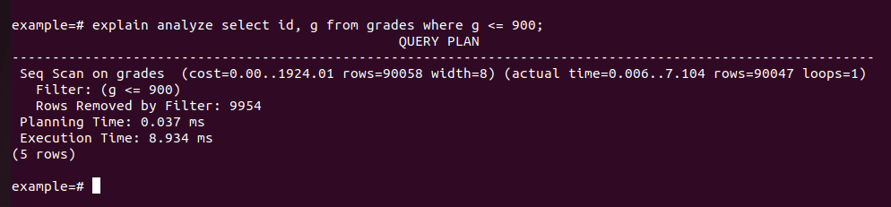

# PostgreSQL
## So sánh với các SQL database khác
| Tiêu chí                  | PostgreSQL  | MySQL      | SQL Server  | Oracle     |
|---------------------------|------------|------------|------------|------------|
| **Hiệu suất truy vấn đơn giản**  | Trung bình  | Nhanh      | Nhanh      | Nhanh      |
| **Hiệu suất truy vấn phức tạp**  | Tốt        | Trung bình | Tốt        | Rất tốt    |
| **Hỗ trợ JSON/NoSQL**     | Rất tốt    | Trung bình | Tốt        | Tốt        |
| **Khả năng mở rộng**      | Tốt        | Trung bình | Rất tốt    | Rất tốt    |
| **Hỗ trợ giao dịch ACID** | Rất tốt    | Trung bình (MyISAM không hỗ trợ) | Rất tốt    | Rất tốt    |
| **Replication**           | Tốt        | Rất tốt    | Rất tốt    | Rất tốt    |
| **Sharding**              | Trung bình (cần tool bên ngoài) | Kém | Tốt | Rất tốt |
| **Chi phí**               | Miễn phí   | Miễn phí   | Trả phí (Enterprise) | Rất đắt |


## CRUD
Create, Read, Update, Delete là các thao tác cơ bản nhất trong cơ sở dữ liệu để quản lý dữ liệu.

### Create (INSERT)
Thao tác này dùng để thêm một bản ghi mới vào CSDL.
```SQL
INSERT INTO users (name, email, age) 
VALUES ('John Doe', 'john@example.com', 30);
```

### Read (SELECT)
Thao tác này dùng để trích xuất các bản ghi từ CSDL.
```SQL
SELECT *
FROM users
WHERE age = 30;
```

### Update (UPDATE)
Thao tác này dùng để thay đổi 1 bản ghi đã tồn tại trong CSDL.
```SQL
UPDATE users
SET age = 31
WHERE name = 'John Doe';
```

### Delete (DELETE)
Thao tác này dùng để xóa 1 bản ghi đã tồn tại trong CSDL.
```SQL
DELETE FROM users WHERE email = 'john@example.com';
```

## Foreign key
### Định nghĩa
Khóa ngoại là một cột (column) hoặc một nhóm các cột trong một bảng tham chiếu tới một hàng trong một bảng khác. Nói cách khác, khóa ngoại được xác định trong bảng tham chiếu đến khóa chính của bảng khác.

Ràng buộc khóa ngoài chỉ ra rằng các giá trị trong một cột hoặc một nhóm các cột trong bảng con khớp với các giá trị trong một cột hoặc một nhóm các cột của bảng cha.

Một bảng có thể có nhiều khóa ngoại tùy thuộc vào mối quan hệ của nó với các bảng khác.

Ví dụ:
```SQL
CREATE TABLE users {
	id SERIAL PRIMARY KEY,
	name TEXT NOT NULL
}

CREATE TABLE orders {
	id SERIAL PRIMARY KEY,
	user_id INT NOT NULL,
	amount DECIMAL(10,2) NOT NULL,
	FOREIGN KEY (user_id) REFERENCES users(id) ON DELETE CASCADE
}
```

### Các loại Foreign key
#### ON DELETE CASCADE
Nếu một bản ghi của 1 bảng bị xóa, tất cả các bản ghi của bảng khác có khóa ngoại đến bản ghi đó đều bị xóa, và tiếp tục lan truyền đến các bản ghi bị xóa đó.
#### ON DELETE SET NULL
Nếu một bản ghi của 1 bảng bị xóa, tất cả các bản ghi của bảng khác có khóa ngoại đến bản ghi đó đều gán lại giá trị khóa ngoại đến bản ghi bị xóa là NULL.
#### ON DELETE RESTRICT
Không được xóa một bản ghi nếu có bản ghi khác có khóa ngoại đến nó.
#### ON DELETE NO ACTION
Nếu một bản ghi của 1 bảng bị xóa hoặc thay đổi, các bản ghi còn lại vẫn giữ nguyên.

## Join
### Định nghĩa
Phép Join dùng để kết hợp các bản ghi của 2 hoặc nhiều bảng dựa trên 1 cột liên quan (thường là khóa ngoại).

### Phân loại
#### INNER JOIN
Chỉ trả về các bản ghi thỏa mãn điều kiện JOIN. Đây là kiểu JOIN mặc định của SQL.

Ví dụ:
```SQL
SELECT *
FROM users
INNER JOIN orders ON users.id = orders.user_id;
```
Chỉ các bản ghi có users.id = orders.user_id mới được trả về.

#### LEFT JOIN
Trả về tất cả các bản ghi nằm ở bên trái và nối với các bản ghi tương ứng ở bên phải. Nếu có bản ghi bên trái không khớp với bất kỳ bản ghi nào bên phải, gán giá trị NULL cho giá trị bên phải đó.

Ví dụ:
```SQL
SELECT *
FROM users
LEFT JOIN orders ON users.id = orders.user_id;
```
Tất cả các bản ghi của users đều được trả về, tương ứng với orders thỏa mãn điều kiện JOIN. Nếu có bản ghi của users không tồn tại bản ghi nào của orders thỏa mãn thì sẽ bị gán giá trị NULL.

### RIGHT JOIN
Tương tự với LEFT JOIN nhưng ngược lại. Phép JOIN này thường không phổ biến và hiếm khi được sử dụng.

#### FULL JOIN
Trả về tất cả bản ghi ở bảng trái và bảng phải kết hợp lại. Nói cách khác, mệnh đề này là kết hợp kết quả của cả hai loại LEFT và RIGHT JOIN.

Ví dụ:
```SQL
SELECT *
FROM users
FULL JOIN orders ON users.id = orders.user_id;
```
Do orders.user_id có khóa ngoại đến users.id, FULL JOIN trong trường hợp này có tác dụng như LEFT JOIN.

## Subquery
Trong PostgreSQL, subquery (truy vấn con) là một truy vấn SQL được nhúng bên trong một truy vấn khác. Subquery có thể xuất hiện trong các câu lệnh SELECT, INSERT, UPDATE, DELETE hoặc trong các điều kiện của WHERE, FROM, HAVING.

Ví dụ, liệt kê tất cả users chi ra nhiều tiền nhất:
```SQL
SELECT users.name
FROM users
WHERE (
	SELECT SUM(orders.amount)
	FROM orders
	WHERE orders.user_id = users.id
) = (
	SELECT MAX(SUM(orders.amount))
	FROM orders
	GROUP BY orders.user_id
)
```

## Index
### Định nghĩa
Index (chỉ mục) trong PostgreSQL giúp tăng tốc truy vấn bằng cách tạo cấu trúc dữ liệu tối ưu để tìm kiếm và lọc dữ liệu nhanh hơn. Khi truy vấn chạy, PostgreSQL có thể dùng index thay vì quét toàn bộ bảng (Sequential Scan), giúp cải thiện hiệu suất đáng kể.

### Các loại index trong PostgreSQL
#### B-Tree Index (Mặc định)
Phù hợp với các truy vấn có dạng range query (truy vấn các bản ghi có giá trị trong khoảng nào đó).

```SQL
CREATE INDEX grades_g ON grades(g);
```

Khi đó, câu lệnh sau sẽ có sử dụng index:
```SQL
SELECT * FROM grades WHERE g > 50;
```

#### Hash Index
Chỉ hỗ trợ các truy vấn có dạng =, tuy nhiên sẽ nhanh hơn nhiều so với B-TREE.

```SQL
CREATE INDEX grades_g ON grades USING HASH (g);
```

#### GiST Index
Phù hợp với dữ liệu phức tạp như tìm kiếm văn bản (FULL-TEXT SEARCH), hình học (PostGIS).

```SQL
CREATE INDEX grades_g ON grades USING GIST (g);
```

#### GIN Index
Phù hợp cho tìm kiếm nhiều giá trị trong một cột (JSON, array, full-text search).

```SQL
CREATE INDEX grades_g ON grades USING GIN (g);
```

#### BRIN Index
Tốt cho bảng rất lớn có dữ liệu sắp xếp theo thứ tự tự nhiên.

```SQL
CREATE INDEX grades_g ON grades USING BRIN (g);
```

### Cách PostgreSQL sử dụng Index
Để kiểm tra 1 lệnh SQL có sử dụng Index không, thêm tiền tố EXPLAIN ANALYZE vào câu lệnh đó. Tuy nhiên, kể cả cột đó có index, chưa chắc PostgreSQL đã sử dụng index đó.

Ví dụ, xét bảng sau với g là số nguyên từ 0 đến 1000. Tiến hành đánh INDEX cho g.
```SQL
create table grades (
id serial primary key, 
 g int,
 name text 
);

CREATE INDEX grades_g ON grades(g);
```

#### INDEX SCAN
Nếu số bản ghi ước tính được đủ nhỏ, Postgres sẽ thực hiện INDEX SCAN trên index đó. Nếu tất cả các cột cần truy vấn đều năm trong index đó, Postgres sẽ sử dụng INDEX ONLY SCAN.


#### BITMAP SCAN
Nếu số bản ghi ước tính được không quá lớn cũng không quá nhỏ, Postgres sẽ dùng index của cột đó, nhưng không trích xuất trực tiếp bản ghi đó ra luôn mà tiến hành đánh bitmap. Sau khi tổng hợp thành 1 bitmap duy nhất (thường là phép AND hoặc OR), tiến hành trích xuất các bản ghi được đánh bitmap đó.


#### SEQ SCAN
Nếu số bản ghi ước tính quá lớn (gần như là cả bảng), Postgres thực hiện truy vấn như không có index.



## Partition
### Khái niệm
Partition trong PostgreSQL là một kỹ thuật giúp chia nhỏ một bảng lớn thành nhiều bảng con (partition) để tối ưu hiệu suất truy vấn, cải thiện khả năng mở rộng và quản lý dữ liệu dễ dàng hơn. 

### Phân loại
#### Range partitioning (Phân vùng theo khoảng giá trị)
_ Dữ liệu được chia thành các partition dựa trên một khoảng giá trị.

_ Phù hợp với các giá trị liên tục (như ngày tháng năm) hoặc các giá trị có thể so sánh được (số nguyên, xâu, ...)

Ví dụ:
```SQL
CREATE TABLE orders (
    id SERIAL PRIMARY KEY,
    order_date DATE NOT NULL,
    amount NUMERIC NOT NULL
) PARTITION BY RANGE (order_date);

CREATE TABLE orders_2023 PARTITION OF orders
    FOR VALUES FROM ('2023-01-01') TO ('2023-12-31');

CREATE TABLE orders_2024 PARTITION OF orders
    FOR VALUES FROM ('2024-01-01') TO ('2024-12-31');
```

Khi đó, truy vấn
```SQL
SELECT * FROM orders
WHERE EXTRACT(YEAR FROM order_date) = 2024;
```
sẽ chỉ truy vấn trong bảng orders_2024, thay vì truy vấn trên bảng orders.

#### List partitioning (Phân vùng theo danh sách)
_ Dữ liệu được chia thành các partition dựa trên các giá trị cụ thể.

_ Phù hợp với dữ liệu có số lượng nhóm nhỏ như vùng địa lý, loại sản phẩm.

Ví dụ:
```SQL
CREATE TABLE customers (
    id SERIAL PRIMARY KEY,
    country TEXT NOT NULL
) PARTITION BY LIST (country);

CREATE TABLE customers_vn PARTITION OF customers
    FOR VALUES IN ('Vietnam');

CREATE TABLE customers_us PARTITION OF customers
    FOR VALUES IN ('USA');
```
Khi đó, truy vấn
```SQL
SELECT * FROM orders
WHERE country = 'Vietnam';
```
sẽ chỉ truy vấn trên bảng customers_vn.

#### Hash partitioning (Phân vùng theo giá trị hash)
_ Dữ liệu được chia thành các partition dựa trên giá trị băm của cột.

_ Phù hợp khi cần chia dữ liệu đồng đều mà không thể dùng range hoặc list.

Ví dụ:
```SQL
CREATE TABLE transactions (
    id SERIAL PRIMARY KEY,
    user_id INT NOT NULL,
    amount NUMERIC NOT NULL
) PARTITION BY HASH (user_id);

CREATE TABLE transactions_p0 PARTITION OF transactions
    FOR VALUES WITH (MODULUS 4, REMAINDER 0);

CREATE TABLE transactions_p1 PARTITION OF transactions
    FOR VALUES WITH (MODULUS 4, REMAINDER 1);
```

## Transaction
### Định nghĩa
Transaction là 1 tập hợp gồm 1 hoặc nhiều câu lệnh SQL được thực thi như 1 câu khối lệnh SQL. Hay nói cách khác, khối lệnh SQL này chỉ được coi là thực thi thành công nếu tất cả các câu lệnh trong đó được thực thi thành công.

### Tính chất
Transaction trong PostgreSQL thỏa mãn 4 tính chất ACID của CSDL quan hệ thông thường:
* **Atomicity**: Tất cả các câu lệnh trong transaction phải thành công hết hoặc fail hết.
* **Consistency**: CSDL giữ nguyên trạng thái hợp lệ sau mỗi transaction.
* **Isolation**: Các transaction khác nhau không ảnh hưởng đến nhau, kể cả khi chúng được thực thi đồng thời.
* **Durability**: Sau khi transaction được COMMIT, thay đổi sẽ được coi là vĩnh viễn, kể cả khi hệ thống sập.

### Isolation levels
Isolation levels có thể được hiểu là mức độ cô lập giữa các transaction được thực hiện đồng thời. Trong CSDL quan hệ có 4 mức độ cô lập như sau.
#### 1. Read uncommitted
- Mức độ cô lập thấp nhất.
- Cho phép tất cả các transaction hoạt động đúng theo thứ tự mà không phải chờ đợi các transaction khác.
- Giúp các transaction được thực hiện với tốc độ rất cao
- Nhược điểm lớn của mức độ này là các transaction có thể đọc dữ liệu chưa được commit. Lỗi này còn được gọi là **Dirty Read**.

#### 2. Read committed
- Level mặc định của PostgreSQL. 
- Các transaction sẽ không thể đọc được dữ liệu chưa được commit từ các transaction khác.
- Có thể tránh được **Dirty Read**.
- Nhược điểm là khi gọi cùng 1 truy vấn 2 lần khác nhau trong 1 transaction, có thể ra kết quả khác nhau. Lỗi này gọi là **Unrepeatable Read**.

#### 3. Repeatable Read
- Đảm bảo các truy vấn giống nhau trong cùng 1 transaction sẽ trả về kết quả giống nhau, do đó tránh được **Unrepeatable Read**.
- Tuy nhiên, không thể tránh được **Phantom Read**.

#### 4. Serializable
- Các transaction được thực hiện lần lượt, đảm bảo mỗi thời điểm chỉ xử lý tối đa 1 transaction.
- Tránh được các lỗi liên quan đến isolation level, tuy nhiên hiệu năng bị giảm đáng kể.

#### 5. Snapshot Isolation
Ngoài 4 mức độ thường dùng của CSDL thông thường, PostgreSQL còn hỗ trợ 1 mức độ nữa cũng có khả năng tránh được các lỗi liên quan đến isolation level, gọi là **Snapshot Isolation**. Mỗi lần thực thi truy vấn, PostgreSQL sẽ tạo ra 1 bản sao cho dữ liệu hiện tại, sau đó thực thi transation trên bản sao đó. Do bản sao không thể thay đổi khi thực thi transaction nên sẽ tránh được mọi lỗi liên quan.

Tuy nhiên, việc tạo mới, xóa bỏ hoặc đồng bộ các bản sao không dễ dàng, do đó PostgreSQL hỗ trợ thêm tính năng MVCC (Multiversion Concurrency Control) để hỗ trợ kiểm soát các bản sao được tạo ra.